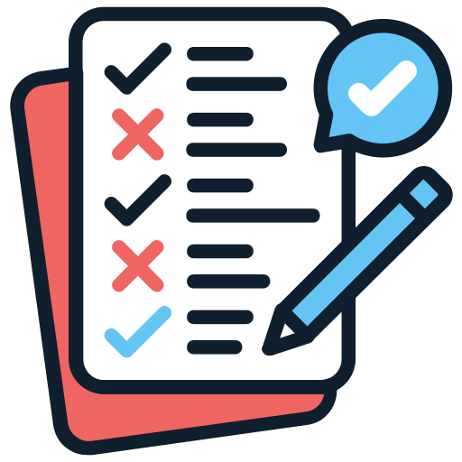

# Gemachte Erfahrungen

In diesem Kapitel werde ich meine Semesterarbeit reflektieren.


{: width="250px" }

[Quelle](../Quellenverzeichnis/index.md#erfahrungen)

# Probleme

## Camunda

Ich hatte schon länger nicht mehr mit Camunda gearbeitet und musste mich nochmal kurz durch meine 2.Semesterarbeit durchlesen. Beim versuch mein .bpmn File zu deployen warf es mir immer Errors aus. Nach längerer Fehlersuche habe ich dann bemerkt, dass ich eine alte Version des .bpmn files für das Deployen gewählt habe (in einem falschen pfad), weshalb es nicht funktioniert hat. Ich suchte in meinem Repo nach dem aktuellen file und habe dieses gefunden. Schlussendlich klappte dann auch das Deployen und ich konnte mit der Arbeit weiter machen.

## Helm Chart

Ursprünglich war geplant die gesammte Camunda Umgebung mit einem existierenden Helm Chart auf Kubernetes zu deployen. Das Problem war jedoch, dass ich nirgends beschrieben ist was die mindest Anforderungen an die Kubernetes Umgebung ist. Nach dem deployen des Helm Chart habe ich dann bemerkt, dass eine ziemlich grosse Umgebung aufgebaut wird. Mir wurde schnell klar, dass die Umgebung auf der uns zur Verfügung gestellte Hardware (MAAS) nicht laufen wird, da etliche Pods nicht gestartet werden konnten. Ich bin dann auf einen einzelnen Container ausgewichen, damit ich weiter arbeiten und mich auf das Deployment des Businessporzess konzentrieren konnte.

## Runner

Damit der Arc-Runner auf meine Kubernetes funktioniert, muss bei dem Deployment ein Github *Personal Access Token* mitgegeben werden. Ich habe dazu folgenden Anleitung befolgt [Link](https://raw.githubusercontent.com/pstark-code/kubernetes-homelab/refs/heads/main/04-neuer-cluster/resourcen/ingress-controller-with-hostnetwork.yaml). Nach dem erstellen des *Personal Access Token* und dem Deployen des Runners, kam der "Listener" Pod nie hoch. Ich habe dann einige Zeit gebraucht bis ich herausgefunden habe, dass ich einen falschen Token erstellt habe (Fine-grained token). Nach dem erstellen des richtigen Token (*Personal access tokens (classic)*) und dem erneuten Deploy des Runners wurde der "Listener" Pod schlussendlich erstellt und hat sich die Pipeline aufgabe geholt.

## Testing

Da ich ein End-to-End Testing mache musste, habe ich nach tools gesucht, welche mir dabei helfen. Ich bin durch einen alten Arbeitskollegen auf Playwright gestossen. Das Tool lässts sich einfach in VSCode integrieren und man kann damit schnell und einfach Testcases erstellen. Lokal hat dann alles schnell funktioniert. In der Pipeline hat das ganze dann etwas anders ausgesehen. Ich merkte, dass es Probleme gab die Dependecies auf den Pod zu installieren. Ich habe mich dann auf die Fehleranalyse gemacht und bemerkt, dass meine Pods immer wieder den Status *Evicted* bekommen haben. Auf den Nodes hatte ich zwischendurch Taints drauf. Ich hatte beim Bauen der Umgebung mit Terraform meinen Workers und dem control plane zu wenig Ressourcen gegeben. Ich musste also die ganze Umgebung erneut bauen und habe die nötigen Terraformdateien angepasst. Als ich alles wieder zum laufen bekommen habe, konnten die Dependecies auf dem Pod installiert werden und das Testing hat funktioniert.

### Storageclass

Das erstellen der neuen Umgebung mit mehr Ressourcen war jedoch nicht ganz alles. Der Runner hat die ganzen Dependecies vorrübergehend in den RAM des Worker-Nodes gespeichert, was nicht gewollt war. Ich musste deshalb noch eine Storageclass erstellen, damit der "Runner Pod" ein PVC anlegen konnte und die Dependecies darin speicher konnten. Da der Pod aber ein *Ephermal Volume* anlegt, wird dieser PVC nach dem "sterben" des Pods acuh "sterben" und de Speicher wird wieder freigegeben.

## Ingress

Ich hatte anfangs Mühe zu verstehen wie Ingress in meinem Projekt funktionieren soll. Nach einem Gespräch mit dem Fachexperten Philipp Stark konnte ich meine Verwirrung immer mehr ablegen.
Der Ingress Controler (Nginx) und das Deployment hatte ich relativ schnell zusammen. Jedoch funktionierte sie nicht. Ich habe mit Philipp Stark dann das Debuging begonnen. Nach dem ausführen von "kubectl get ingressclasses" haben wir folgendes erhalten:
```
$ kubectl get ingressclasses
NAME    CONTROLLER             PARAMETERS   AGE
nginx   k8s.io/ingress-nginx   <none>       47h
```

In meinem Ingress Deployment hatte ich aber folgendes konfiguriert:
```
apiVersion: networking.k8s.io/v1
kind: Ingress
metadata:
  name: camunda-ingress
  namespace: default
  annotations:
    nginx.ingress.kubernetes.io/rewrite-target: /
spec:
  ingressClassName: ingress-nginx
  rules:
  - host: cloud-hf-14-w1.maas        
    http:
      paths:
      - path: /
        pathType: Prefix
        backend:
          service:
            name: camunda-service   
            port:
              number: 8080          

```
Der **ingressClassName** hat nicht gestummen. Nach der Anpassung hat dann alles sauber funktioniert. Der Grund warum ich über den Port *30642* auf den Camunda-Service zugreifen muss ist, weil ich bei der Ingres Controller installion die Anpassung für den Nodeport nicht gemacht habe. Philipp Stark hat mich darauf hingewiesen.

# Lessions Learned


# Reflexion der ganzen Semesterarbeit

