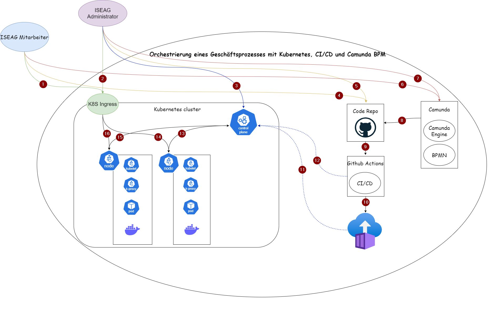

# SEUSAG

Um die Systemabgrenzungen zu veranschaulichen, habe ich ein SEUSAG erstellen. Somit werden Systemgrenzen geklärt, Einflussgrössen ermittelt, Unter - / Teilsysteme isoliert, Schnittstellen definiert, Analysen von Elementen - Dimensionen und Beziehungen erstellt und Gemeinsamkeiten erkannt.

[Hier](https://1drv.ms/i/c/77fe47fd6cd90d40/Ee-fHt-sSHNGgnZ7JjpeoX8BcOM6dRM1q4U2HSibWNqGqw?e=VP0ggf) kann das SEUSAG noch in einer besseren Qualität angesehen werden.

Hier werden die einzelnen Schnittstellen beschrieben. Die Nummerierung dient lediglich der Zuweisung und hat keinerlei Bedeutung für den Ablauf.

1. Externer Zugriff auf den POD (Zugriff auf das Camunda Dashboard mit den BPMN Prozessen)
2. Externer Zugriff auf den POD (Zugriff auf das Camunda Dashboard mit den BPMN Prozessen)
3. Zugriff auf den Controle Plane (Master Node)
4. Getägtigte Arbeiten werden auf das 4.Semesterarbeit Repository gepostet
5. Aufbereitung der Camunda BPMN Prozesse
6. Der Aufbereitete Camunda Prozess wird auf das 4.Semesterarbeit Repository gepostet
7. Konfigurieren einer CI/CD Pipeline auf Github
8. Durch die CI/CD Pipeline wird ein Docker Container erstellt
9. Durch die CI/CD Pipeline wird automatisiert eine Kubernetes-Umgebung aufgebaut
10. Der Docker Container wird auf einem oder mehrere Nodes Applied
11. Kommunikation zwischen Nodes und Controle Plane
12. Kommunikation zwischen Nodes und Controle Plane