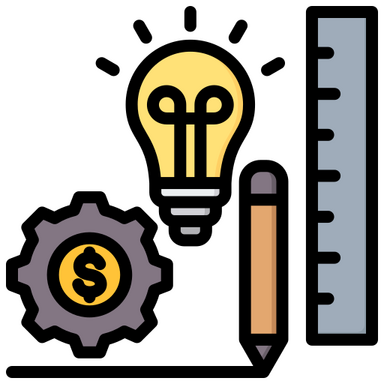

# Measure Phase

Da ich mit der Qualitätsmanagementmethode *Lean Six Sigma* arbeite, werde ich Schritt für Schritt den *DMAIC* Zyklus durchgehen und somit den Prozess zu bearbeiten. 

Der zweite Schritt dazu ist die *Measure Phase*. Was in dieser Phase genau geschieht, wird in der Einleitung unter Punkt 2.5 Projektmanagement-Methode beschrieben.

[Quelle](../Quellenverzeichnis/index.md#measure)

## Ist-Zustand

Die *Measure Phase* wird hier aus der Sicht der ISEAG betrachtet.

1. 