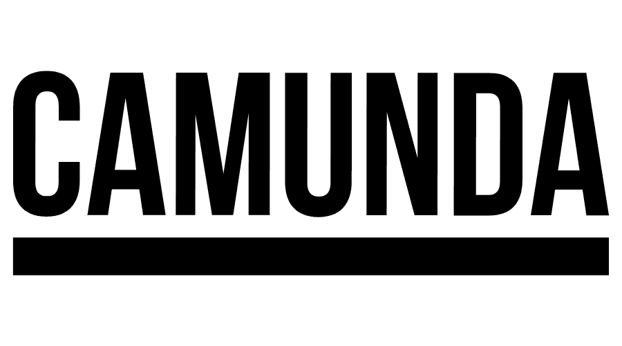

# Improve Phase

Da ich mit der Qualitätsmanagementmethode *Lean Six Sigma* arbeite, werde ich Schritt für Schritt den *DMAIC* Zyklus durchgehen und somit den Prozess zu bearbeiten. 

Der vierter Schritt dazu ist die *Improve Phase*. Was in dieser Phase genau geschieht, wird in der Einleitung unter Punkt 2.5 Projektmanagement-Methode beschrieben.

[Quelle](../Quellenverzeichnis/index.md#improve)

[Quelle](../Quellenverzeichnis/index.md#camunda)

### Was ist Kubernetes ?

### Umsetzung (Improve)

