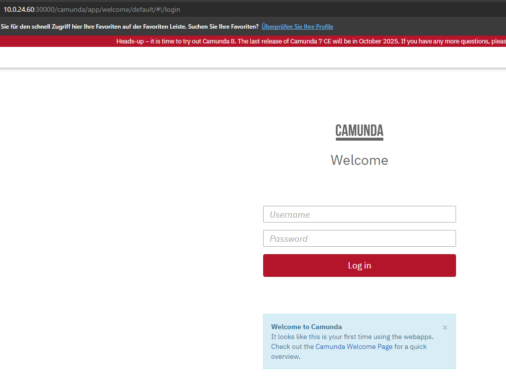
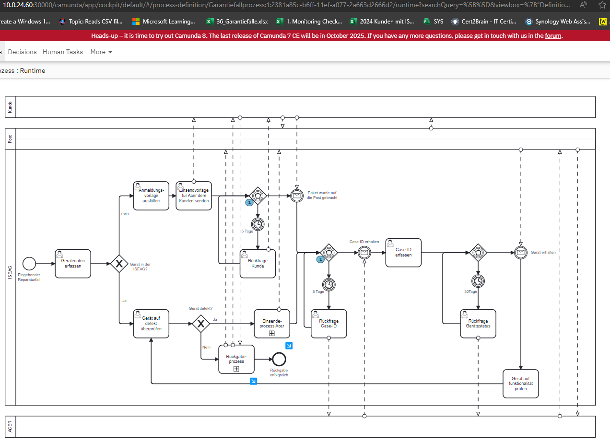

# Improve Phase

Da ich mit der Qualitätsmanagementmethode *Lean Six Sigma* arbeite, werde ich Schritt für Schritt den *DMAIC* Zyklus durchgehen und somit den Prozess zu bearbeiten. 

Der vierter Schritt dazu ist die *Improve Phase*. Was in dieser Phase genau geschieht, wird in der Einleitung unter Punkt 2.5 Projektmanagement-Methode beschrieben.

{: width="250px" }

[Quelle](../Quellenverzeichnis/index.md#improve)


## Was ist Kubernetes ?

Kubernetes ist eine Open-Source-Plattform zur Automatisierung der Bereitstellung, Skalierung und Verwaltung containerisierter Anwendungen. Es ermöglicht die Orchestrierung von Containern über Cluster von Hosts hinweg und bietet Funktionen wie Load Balancing, automatisierte Rollouts und Rollbacks sowie Selbstheilung von Anwendungen. Kubernetes optimiert die Ressourcennutzung und unterstützt DevOps-Methoden durch eine nahtlose Integration in CI/CD-Pipelines. Die Plattform ist flexibel, skalierbar und unterstützt verschiedene Cloud- und On-Premise-Umgebungen, was sie zu einem zentralen Werkzeug für moderne Softwareentwicklung macht.

## Warum Kubernetes ?

Für meine Semesterarbeit verwende ich Kubernetes als Host für meine Camunda-Umgebung. Da die Umgebung automatisiert über eine CI/CD-Pipeline erstellt werden soll, bietet sich Kubernetes ideal an. Zudem behandeln wir das Thema Kubernetes in der Schule, und ich möchte mich durch dieser Semesterarbeit weiter darin vertiefen. Kubernetes bietet auch direkte Funktionen für Selbstheilung und Rollbacks.

{: width="250px" }

## Was ist eine CI/CD Pipeline ?

Eine CI/CD-Pipeline (Continuous Integration/Continuous Deployment) automatisiert den Prozess der Softwareentwicklung, indem sie Codeänderungen kontinuierlich integriert, getestet und bereitgestellt werden.

## CI/CD mit Github Actions

GitHub Actions ist ein Tool, das diese Automatisierung direkt auf GitHub ermöglicht. Es erlaubt uns, Workflows zu erstellen, die bei bestimmten Ereignissen wie "push" oder "pull request" automatisch ausgelöst werden. Ein Workflow besteht aus "Jobs", die in "Schritten" organisiert sind und individuelle Befehle oder Aktionen enthalten.

Wie mein Workflow aussehen wird:

*Continuous Integration (CI):* Mein Workflow-Job erstellt einen Container, der die Camunda-Engine und die BPMN-Dateien enthält, und führt danach Unit-Tests aus.

*Continuous Deployment (CD):* Nach erfolgreichem Testen wird das Docker-Image in die GitHub Container Registry (ghcr.io) gepusht und dann in einer Kubernetes-Umgebung bereitgestellt und automatisch gestartet.

Die Pipeline wird über eine YAML-Datei in .github/workflows konfiguriert.


## Umsetzung (Improve)

### Erstellen und betreiben des Camunda Containers

Als erstes habe ich ein Dockerfile erstelle um ein Docker-Image zu generieren was auch eines meiner Ziele war. Dabei konnte ich ein bestehendes Docker-Image von Camunda verwenden. Das Dockerfile habe und meine BPMN und Form's Files habe ich erst auf Docker-Desktop deployed um zu repetieren wie das ganzen Camunda zu bedienen ist. Ich habe mir im Anschluss viele Recherchen betrieben und mir gedanken gemacht, wie ich meine BPMN und Form Files automatisiert auf die Camunda Engine deployen kann. Ich hatte dann auch Kontakt mit Thomas Kälin. Er hat mir vorgeschlagen, aus meinem lokalen Docker Container erneut ein Image zu generieren, in welchem meine Deployten Files integriert sind. Auf diesem Weg kann ich zwar den Container komplett auf Kubernetes Deployen, die automationen in einer Pipeline wird dann aber eher schwirieg. Nach weitere Recherchen habe ich dann gesehen, dass Camunda ein Helm Chart anbietet, welches auf Kubernetes deployed werden kann. Diese Chart habe ich dann versucht auf den Kubernetes Cluster von Philipp Stark zu deployen, welchen wir währen des CNC Moduls aufgesetzt haben. Leider schien die Umgebung die das Helm Chart baut zu gross für die Umgebung zu sein. Ich habe mich dann entschieden auf das MAAS von Marcel zu wechseln. Hier musste aber erst eine Kubernetes Umgebung aufgebaut werden.

### Erstellen einer Kubernetes Umgebung mit Terraform

Wir haben während der Semesterarbeit mit dem Modul Terraform begonnen und konnten schon einige Hands on Übungen durchführen. Da mein Know how für das erstellen einer kompletten Kubernetes Umgebung jedoch noch zu klein war, konnte ich eine Vorlage von einem Klassenkollegen Yves Wetter übernehmen. In der Vorlage musste das [cloud_init_k0s.yaml](../../cloud_init_k0s.yaml), [data.tf](../../data.tf) und das [main.tf](../../main.tf) angepasst werden, damit das Deployment auf meinen Nodes ausgerollt wird. Nach dem Erstellen der Umgebung gab es aber probleme mit dem Deployen des Camunda Containers. Das Problem war, dass das Syslogfile zu gross war und gelöscht werden musste.

### Deployen des Camunda Containers und der Businessprozesse

Damit ich den Container auf die Kubernetes Umgebung deployen kann, habe ich mithilfe von ChatGPT ein [deployment.yaml](../../camunda-deployment.yaml) erstellt, in welchem das camunda-image in einem Contaner betrieben wird. Die Camunda-Engine ist dann über den Port 8080 über den Container ansprechbar. Der Port 8080 wird dann an den Nodeport 30000 weitergeleitet, damit ich später vom MAAS Netzwerk auf die Engine zugreifen kann.



Nun müssen der Business Prozess auf die Engine deployen werden. In meine 2.Semsterarbeit habe ich das über den Camunda-Modeler direkt gemacht, da diese methode aber manuell ausgeführt werden muss, dient Sie dieser Semesterarbeit nicht. Ich habe aber bereits mit der REST-API Schnittstelle des Modelers im 2.Semester gearbeitet und habe dann nach einer POST-Methode gesucht. Diese fand ich schliesslich auch auf der Camunda Homepage. Nach weiteren Recherchen nutze ich PODMAN um den Post zu testen. Es zeigte mir anfangs an, dass das Deployment nicht funktioniert, weil etwas im .bpmn file nicht stimmte. Ich habe erst einige Zeit später bemerkt, dass ich beim POST nicht auf das Finale .bpmn file des 2.Semesters verwiesen habe, weshalb es mir immer den Fehler angezeigt hat. Nach anpassen des pfades für das File konnte ich schlussendlich das .bpmn file über die REST-API Schnittstelle deployen. Glücklicherweise kann man im PODMAN die Abfrage als CURL einsehen. Ich habe dann das ganze deployment mit POSTMAN vorbereitet und habe mir dann den CURL Befehl kopiert. Diese sieht wie folgt aus:

```
curl --location 'http://10.0.24.60:30000/engine-rest/deployment/create' \
--header 'Content-Type: multipart/form-data' \
--form "upload=@C:\\Users\\dennis.buathong\\OneDrive\\Dokumente\\Gitrepos\\ITCNE23\\4.Semester\\Semesterarbeit\\SemArb4-CD-und-Camunda-BPM\\processes\\Grundgeruest.bpmn" \
--form "upload=@C:\\Users\\dennis.buathong\\OneDrive\\Dokumente\\Gitrepos\\ITCNE23\\4.Semester\\Semesterarbeit\\SemArb4-CD-und-Camunda-BPM\\processes\\Anmeldeformular.form" \
--form "upload=@C:\\Users\\dennis.buathong\\OneDrive\\Dokumente\\Gitrepos\\ITCNE23\\4.Semester\\Semesterarbeit\\SemArb4-CD-und-Camunda-BPM\\processes\\Datenerfassung.form" \
--form "upload=@C:\\Users\\dennis.buathong\\OneDrive\\Dokumente\\Gitrepos\\ITCNE23\\4.Semester\\Semesterarbeit\\SemArb4-CD-und-Camunda-BPM\\processes\\Datensicherung.form" \
--form "upload=@C:\\Users\\dennis.buathong\\OneDrive\\Dokumente\\Gitrepos\\ITCNE23\\4.Semester\\Semesterarbeit\\SemArb4-CD-und-Camunda-BPM\\processes\\Defektanalyse.form" \
--form "upload=@C:\\Users\\dennis.buathong\\OneDrive\\Dokumente\\Gitrepos\\ITCNE23\\4.Semester\\Semesterarbeit\\SemArb4-CD-und-Camunda-BPM\\processes\\Abholung.form"
```
Die Dateiablage wird zu eine spätere Zeitpunkt auf Github verweisen.
Das Testing hat dann jedoch gezeigt, dass nicht alles gleichzeitig deployed werden kann, weshalb ich mithilfe von ChatGPT ein [Shellskript](../../upload.sh) erstellt habe, welches die Files nach einander Deployed (delay von 1 Sekunde). Nach dem Ausführen des Skript, wird der Businessprozess nun voll funktionsfähig im Camunda angezeigt.



### Deployen einer Postgres Datenbank mit PV und PVC

Camunda speichert per default die Prozessinstanzen auf dem Host der Engine, in meinem Fall auf einem Pod. Das macht für meinen Anwendefall mit Kubernetes keinen Sinn. Ich habe herausgefunden, dass Camunda eine Postgres Datenbank anlegt und die Prozessinstanzen darin gespeichert wird. Mit ChatGPT konnte ich das [postgres-deployment.yaml](../../postgres-deployment.yaml) erstellen, damit die Prozessinstanzen auf einen separaten Postgres Pod ausgelagert werden. Das mache ich nur aus akademischen Gründen so. In einer Business Umgebung würde ich die Postgres Datenbank komplett auslagern und nicht in Kubernetes betreiben. Damit die Postgres Datenbank jedoch funktioniert braucht diese einen festen Speicher (Persistent Volume - *PV*). Dazu habe ich das [postgres-pv.yaml](../../postgres-pv.yaml) erstellt. Damit das *Persistent Volume* auch benutzt werden kann, musste ein weiters deployment erstellt werden [postgres-pvc.yaml](../../postgres-pvc.yaml). Im [Postgres-deployment](../../postgres-deployment.yaml) wird dann das *PVC* gemountet. Im [Camunda-deployment](../../camunda-deployment-wpostgress.yaml) wird dann im *ENV* die Datenbank mitgegeben. Die Camunda Engine weiss nun, dass die Prozessinstanzen auf der neu erstellten Datenbank abgelegt werden muss. Der Postgres Pod wiederrum schreibt die Datenbank auf das *Persistent Volume*. Mit dieser Konfiguration können nun die Pods gelöscht und wieder neu gebaut werden. Die Daten bleiben immer auf dem *Persistent Volume*


### CI/CD Pipeline auf Github erstellen

Um die Anpassungen der BPMN-Form Files automatisiert auf den Kubernetes Cluster zu deployen habe ich mir das Ziel gesetzt eine eine CI/CD Pipeline mit **Github Actions* zu erstellen. Da mein Cluster nicht von ausserhalb des Schulnetzes erreichbar ist, musste ich mir überlegen, wie Github auf die Umgebung zugreifen kann. Ich habe dann eine Anleitung gefunden, um einen Runner zu konfigurieren, welches mein *Personal access token* beinhaltet. Den Token musste ich erst erstellen. Wie man das macht wird in dieser [Anleitung](https://docs.github.com/en/actions/hosting-your-own-runners/managing-self-hosted-runners-with-actions-runner-controller/quickstart-for-actions-runner-controller#legal-notice) beschrieben.