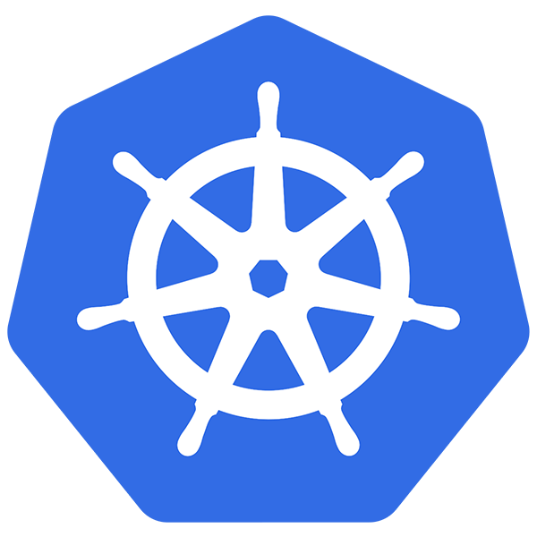

# Improve Phase

Da ich mit der Qualitätsmanagementmethode *Lean Six Sigma* arbeite, werde ich Schritt für Schritt den *DMAIC* Zyklus durchgehen und somit den Prozess zu bearbeiten. 

Der vierter Schritt dazu ist die *Improve Phase*. Was in dieser Phase genau geschieht, wird in der Einleitung unter Punkt 2.5 Projektmanagement-Methode beschrieben.

[Quelle](../Quellenverzeichnis/index.md#improve)

### Was ist Kubernetes ?

Kubernetes ist eine Open-Source-Plattform zur Automatisierung der Bereitstellung, Skalierung und Verwaltung containerisierter Anwendungen. Es ermöglicht die Orchestrierung von Containern über Cluster von Hosts hinweg und bietet Funktionen wie Load Balancing, automatisierte Rollouts und Rollbacks sowie Selbstheilung von Anwendungen. Kubernetes optimiert die Ressourcennutzung und unterstützt DevOps-Methoden durch eine nahtlose Integration in CI/CD-Pipelines. Die Plattform ist flexibel, skalierbar und unterstützt verschiedene Cloud- und On-Premise-Umgebungen, was sie zu einem zentralen Werkzeug für moderne Softwareentwicklung macht.

### Warum Kubernetes ?

Für meine Semesterarbeit verwende ich Kubernetes als Host für meine Camunda-Umgebung. Da die Umgebung automatisiert über eine CI/CD-Pipeline erstellt werden soll, bietet sich Kubernetes ideal an. Zudem behandeln wir das Thema Kubernetes in der Schule, und ich möchte mich durch diese Semesterarbeit weiter darin vertiefen. Kubernetes bietet auch direkte Funktionen für Selbstheilung und Rollbacks.

### Was ist eine CI/CD Pipeline ?

{: width="250px" }

### Umsetzung (Improve)

