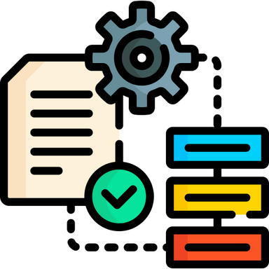

# Control Phase

Da ich mit der Qualitätsmanagementmethode *Lean Six Sigma* arbeite, werde ich Schritt für Schritt den *DMAIC* Zyklus durchgehen und somit den Prozess zu bearbeiten. 

Der fünfte Schritt dazu ist die *Control Phase*. Was in dieser Phase genau geschieht, wird in der Einleitung unter Punkt 2.5 Projektmanagement-Methode beschrieben.

[Quelle](../Quellenverzeichnis/index.md#control)

Die *Control Phase* dient einer längeren Zeitperiode. Der angepasste Prozess wird so fortlaufen auf seine Nachhaltigkeit und Optimierungsmöglichkeit überprüft. 