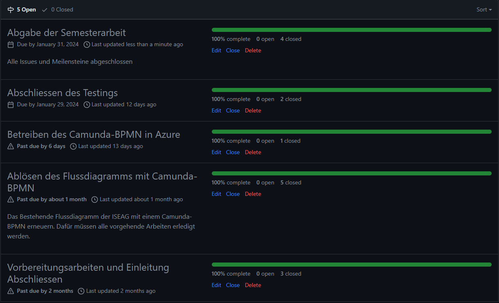
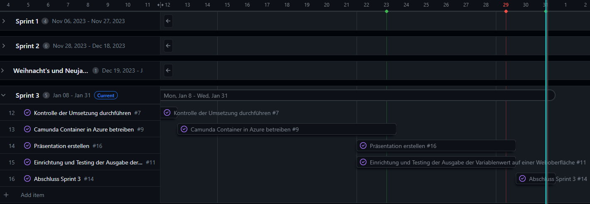

# 3. Sprintabschluss

[Milestones - Bazzako/SemArb2-BPM](https://github.com/Bazzako/SemArb2-BPM/milestones)

Im Gantt-Diagramm (Gantt Nach Sprints) sieht es aktuell wie folgt aus. Der blaue Strich visualisiert das Ende des 3.Sprints.

[Gantt Nach Sprints · 2 Semesterarbeit - BPM](https://github.com/users/Bazzako/projects/3/views/4)

## Wie ist es mir ergangen ?

## Abschluss
