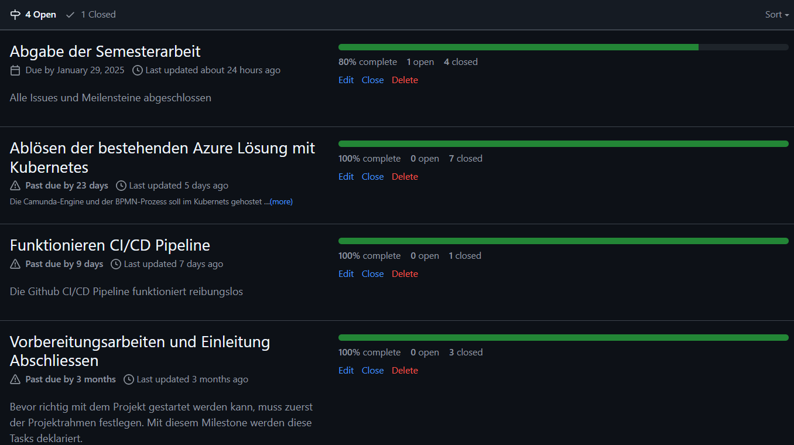
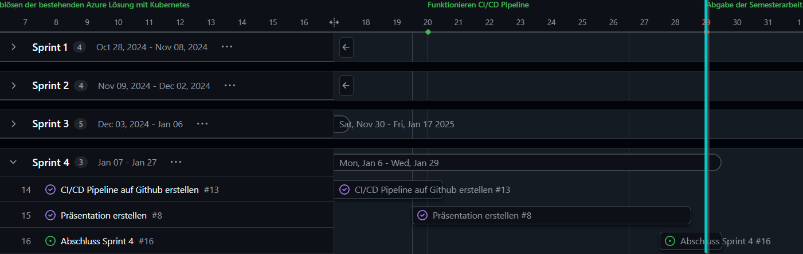

# 4. Sprintabschluss

Rückblickend auf den letzen Sprint kann ich sagen, dass ich alle offenen Tasks abschliessen konnte. Ich konnte alle Meilensteine beenden.

[Milestones - Bazzako/SemArb2-BPM](https://github.com/Bazzako/SemArb2-BPM/milestones)

Im Gantt-Diagramm (Gantt Nach Sprints) sieht es aktuell wie folgt aus. Der blaue Strich visualisiert das Ende des 3.Sprints.

[Gantt Nach Sprints · 2 Semesterarbeit - BPM](https://github.com/users/Bazzako/projects/3/views/4)

## Konnten alle Ziele erreicht werden ?

Ja, alle Ziele konnten erreicht werden. Leider musste ich einige Ziele anpassen, da sie entweder wenig Sinn ergaben oder nicht umsetzbar waren. [Hier](../Abschluss/Erreichte_Ziele.md) mehr dazu.

## Was ist mir gut gelaufen, wo hatte ich Probleme?

Diese Punkte habe ich im [Abschluss](../Abschluss/Erfahrungen.md) bereits dokumentiert.
